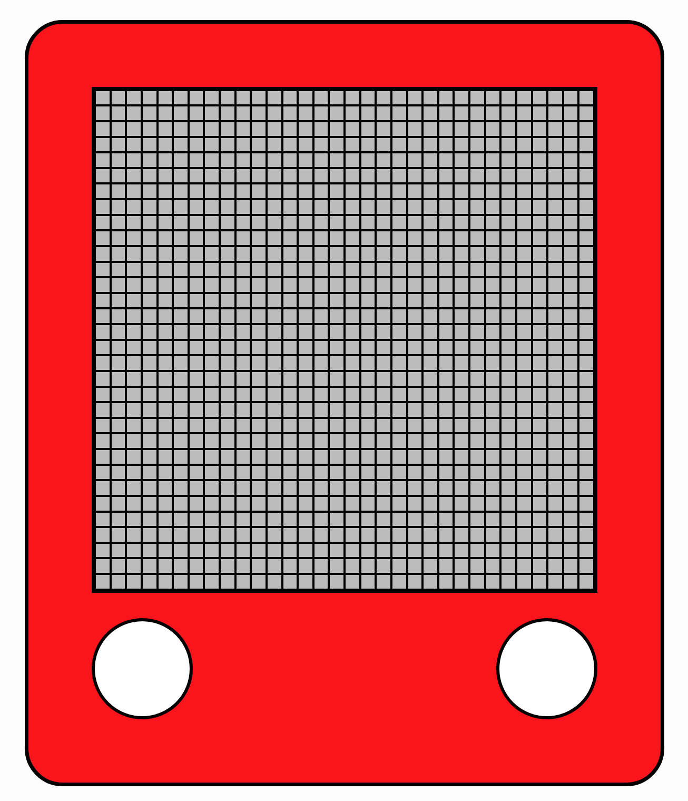

# Etch-A-Sketch
The goal of this project was to create a JavaScript web application that allows a user to draw on a grid container of divs like an etch-a-sketch pad. The project outline specifically focused on creating this grid without using CSS grid and instead using Flexbox to accomplish the same goal. I achieved this using a nested for loop that creates n amount of rows and then within each row creates n amount of columns based on n as a function parameter. Once the grid is created, each individual square div in the grid has a mouse enter event that alters the class to be filled in to mimic the functionality of the kid's toy.

## Features
1. Single page online game website with a header, a footer and a main
2. Header contains the title of the game, and a brief instruction on how to reset the board and change grid size


3. A reset button that calls the clearGrid function and prompts the user for a new grid size. If the user attempts to input a grid size above or below the limits, it will reject the number


4. The sketchpad has the container div in the center that the grid is created in with JavaScript, as well as decorational "knob" divs on the bottom to mimic the look of the kid's toy


5. Footer contains the copyright information


## Local Project Setup

1. **Clone the repository**
```git clone https://github.com/thall34/etch-a-sketch```
2. **Navigate to the project directory**
```cd clone-location/etch-a-sketch```
3. **Open the project in your web browser**
```open index.html```

## Live Link

https://thall34.github.io/etch-a-sketch

## Learning Takeaways
This project was challenging to get setup correctly. I did not grasp the concept on how to create a grid until I looked up a hint and then it clicked. Once the grid was in place I just had to figure out how to change the divs to be filled with event listeners. Event listeners were a little weird for me at first too, but it allowed me to step out of my comfort and learn more new things.